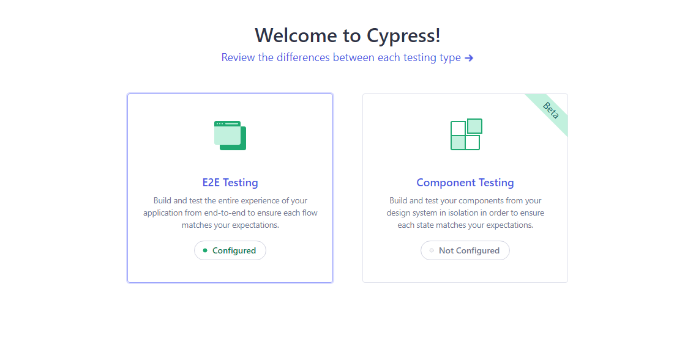

<h1> <b>Buger Eats</b> </h1>

## <b> `Introdução`

<h3> Abaixo uma demonstração de uma Automatização utilizando o Cypress Framework em um site simples que contém apenas duas páginas. A automatização consiste em apenas dois testes: BDD e Fluxo Feliz, não tendo testes relacionados a API.

Apesar de ter apenas duas páginas, a cobertura dos testes está bem completa. Verificando pontos como: Textos, placeholders, Tooltips, Msgs de Sucesso, preenchimento de campos, verificação de valores e muito mais...

BDD Tela Inicial: https://github.com/rgoesgabriel/Buger-Eats/blob/main/cypress/Casos%20de%20teste/Tela%20Inicial.md

BDD Tela Cadastro: https://github.com/rgoesgabriel/Buger-Eats/blob/main/cypress/Casos%20de%20teste/Tela%20de%20Cadastro.md
</h3>

 

## <b> `Executando o teste Automatizado`

- Baixe o repostório
- Execute os comandos abaixo:
  - <i> npm install </i>
  - <i> npx cypress open </i>

## <b> `Conhecendo e Executando o Cypress Automatizador`

### <b> Tela Inicial </b>

<h4> <b> Passo 1: </b> Após executar o último comando, veremos a tela de Boas Vindas do Cypress Automatizador. Escolha a primeira opção: <b> E2E Testing </b>

 

 

<h4> <b> Passo 2: </b> Agora vamos escolher o navegador. O Cypress irá trazer todos os navegadores instalados e uma opção extra chamada "Electron", escolha essa opção para não haver problemas com Anti-Vírus. Após a escolha, clique em "Start E2E Testing" </h4>

 

## <b> `Vamos escolher um teste`

<h4> <b> Abaixo veremos que existem dois tipos de testes... </b> </h4>

 

 

<h4> <b> Opção 1: </b> O teste "BugerEats.cy.js", irá executar um teste automatizado de maneira contínua, será realizado algo parecido com um <b> Plano de Testes. </h4> </b>

 

Obs: Quando o teste for finalizado, será possível ver detalhadamente cada passo do processo que foi automatizado. Basta clicar no teste desejado e passar o mouse por cima de cada ponto, a tela a direita irá mostrar qual foi o processo executado.

 

<b> O processo valida os seguintes pontos: </b>

- Todos os textos contidos nas duas páginas
- Os placeholders de cada campo
- Os valores de cada campo após sua digitação para ter a certeza de que o campo aceitou corretamente a informação digitada
- As urls de ambas as páginas
- Irá conferir se os botões desejados foram clicados corretamente
- Preencherá todos os campos simulando um fluxo feliz
- Salvará o formulário
- Conferência se a página inicial é apresentada

 

 

<h4> <b> Opção 2: </b> O teste "CasosTestes.cy.js", irá executar testes automatizados em BDD.</h4>

 

Obs: Quando o teste for finalizado, será possível ver detalhadamente cada passo do precesso que foi automatizado. Basta clicar no cenário desejado e passar o mouse por cima de cada ponto, a tela a direita irá mostrar qual foi o processo executado.

 

 

